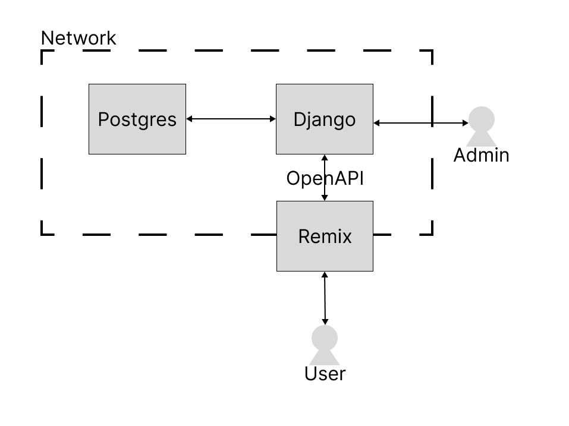

# GraphTable

This is graph table (the name needs work). It's a DMS / ERP for low volume, high complexity sales teams that needs customizable BPM workflows for their product(s). The goal is to streamline and simplify sales process' into something (no-code) programmable and fault tolerant.

## Infrastructure



## Development

### Init

At both project roots copy the `.env.example` file and rename it to `.env`. You can change the values, but the values have to be identical in all projects (think of them like a vault service).

> django_api

In separate tabs run:
- `make services` to start the docker-compose services (postgres & rabbitMQ)
- `make seed` to add the superuser & add a basic user setup
- `make dev` to start the local dev server

Once that's running log into the django admin panel at [http://localhost:8000/admin/](http://localhost:8000/admin/) with "admin /t <DJANGO_SUPERUSER_PASSWORD>".

Manual seed setup:

You'll want to add (in this order)

- a user
- a group
- add that user to the group
- a folder, copying the new id to your copy buffer
- add a permission for the group to the folder, using folder as the content type, and the saved id
- an org, and use the group as the "root"

> remix_frontend

Run `make dev` to start the frontend server.

Goto [http://localhost:4000/](http://localhost:4000/) and login with either your user, or the admin user.

### Schema

For any model changes, the schema and its associated api will (most likely) need an update. To do that run

> django_api

`make api-schema`

> remix_frontend

`make api-lib`

Make sure to commit any changes as the lib / schema isn't generated during builds.

### Access Control

The access control uses ReBAC as it's guiding principle to organize permissions and access to the various documents (ie: individual models, ie: a folder, a kit, a question, etc). The schema is as follows:

```
user ==> group <==> permission --> document ("inherit_permissions_from_parent" --> document)

```

Or in words:

a user belongs to a group(s), which has a permission(s) for a document.

Permissions are defined by `can_create`, `can_read`, `can_update`, and `can_delete` (ie: CRUD, and they're named as such to avoid namespace issues with default django) access and can be any combination imaginable.

A user can belong to many groups and a group can have many permissions, but each permission points to a single document with the exception of documents that allow `inherit_permissions_from_parent`.

Those documents don't need a direct permission, but will inherit whatever permissions are present on it's parent (recursively if multiple levels are present). A document can have many children, but only one parent.

See the abstract model [DocumentModel](./django_api/kits/models.py) for implementation details.
